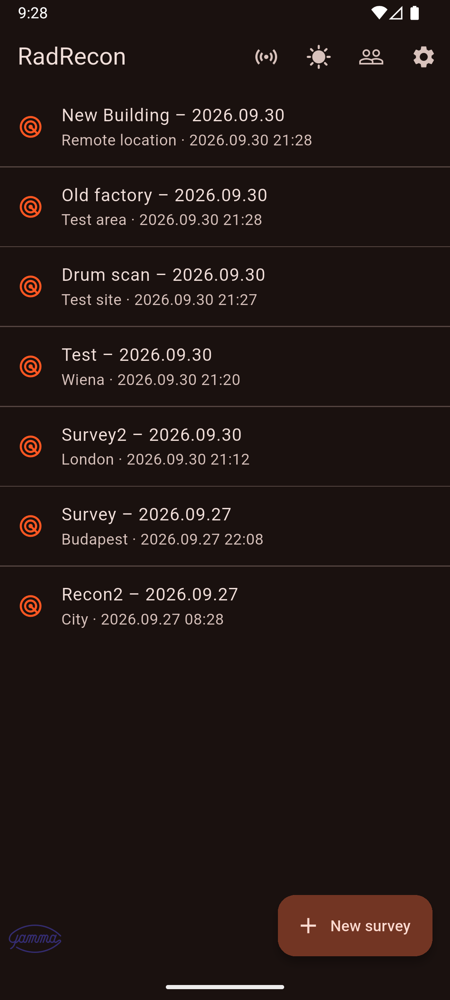

# RadRecon

**Field radiation survey app: every reading located, documented and reported from one record.**

RadRecon is a free, nonprofit civic initiative. Its goal is to make the administration around work involving radiation exposure accurate, quick and efficient, so that radiation protection professionals can spend their time on protection instead of paperwork.

The app is free to use, needs no account and keeps all data on your device. We are looking for **volunteers to test and develop it** (see [Contributing](#contributing)).

> **Status:** under active development. Store releases for Android, iPhone, Windows, macOS and Linux are coming soon.



## What it does

**Surveys and measurement points**
- GPS-tied point logging: position, accuracy radius, time, instrument, value and unit, plus an optional label, note and photo.
- Survey map with all points, so coverage gaps and hot spots are visible on site. Map images can be saved for the report.
- Measurement types: dose rate, surface contamination, count rate (cps), neutron count rate (cps) and sampling.
- Alert thresholds per measurement type, with sound and pop-up.
- Change history for edits to a measurement point.
- Works offline. Only the map background needs an internet connection.

**Instruments and automation**
- Instrument library with calibration date and factor.
- Direct readout from WiFi Modbus/TCP instruments into the entry form.
- Automatic logging at a time or distance interval while you walk.

**Doses and people**
- Dose collection per person: integrated automatically from a Modbus detector during automatic logging, or entered manually, and adjustable when a survey is closed.
- Passive dosimetry results (monthly or bimonthly evaluation) kept independently of surveys.
- Annual dose per person, split into online, manual and passive. CSV import and export of doses.
- Person registry with medical exam and training expiry, with optional reminders.

**Companies**
- Company switching for people who work for more than one employer: separate data per company, automatic save when switching, new company, add company from a backup file, selectable backup folder.
- Database save and load to a backup file, for example when moving to a new phone.

**Sources and tools**
- Radiation source registry with decay-corrected activity, compared with the measured dose rate at a point, including the total of all sources attached to a point.
- Isotope calculator: activity to dose rate and back for Co-60, Cs-137, Ir-192, Ra-226, I-131, Na-22 and Am-241, or a custom nuclide.
- Live distance and bearing to a logged point, and a guided source search based on the gradient of the recorded readings.

**Reporting**
- One-tap Word protocol with point list, map and photos.
- Export as JSON (importable by another RadRecon installation) or CSV for Excel.

**Languages:** the app is available in English and Hungarian. The website and manual are available in English, Hungarian, German, French, Italian and Spanish.

## Important notice

RadRecon is a documentation and calculation aid. It is not a measuring instrument, a dosimeter or a certified safety device, and it does not replace qualified radiation protection experts, calibrated instruments, official personal dosimetry or the procedures required by the competent authority. Gamma constants and half-lives are reference values: verify them against an authoritative source before using a result in an official record.

## Getting started (development)

Requirements: a Flutter SDK that ships Dart `^3.13.1` (see `pubspec.yaml`).

```bash
flutter pub get
flutter gen-l10n
flutter run
flutter test
```

Release helper scripts are in the repository root: `build_android_release.sh`, `build_iphone_release.sh`, `build_macos_dmg.sh`, `build_windows_release.bat`.

### Project layout

| Path | Content |
|---|---|
| `lib/screens` | UI screens |
| `lib/models` | Data models (survey, measurement point, person, dose, source, instrument) |
| `lib/services` | Modbus reader, dose integration, import/export, company backup, notifications |
| `lib/database` | Local SQLite database |
| `lib/l10n` | Translations (`app_hu.arb` is the template, `app_en.arb` the English version) |
| `landingpage` | Static website and user manual in six languages |

### Translations

The app strings live in `lib/l10n/*.arb`. To add a language, copy `app_en.arb` to `app_<code>.arb`, translate the values and run `flutter gen-l10n`. Translators are very welcome.

## Contributing

We need:
- **Testers** with real field experience, on any platform, ideally with a Modbus/TCP instrument.
- **Developers** for the Flutter/Dart codebase: features, fixes, tests and documentation.
- **Radiation protection professionals** to review calculations, terminology and workflows.
- **Translators** for more app languages.

Sign up as a volunteer: https://forms.gle/7EgHLe6yQr8pV5Qt9
Or write to info@radrecon.hu. Issues and pull requests on GitHub are welcome.

By submitting a contribution you agree that it is made available under the same license as the project (see below).

## Contributors

Everyone who tests, develops, reviews or translates can be thanked by name, optionally with their company or organization. The list lives in [`landingpage/contributors.json`](landingpage/contributors.json) and is shown on the website and in the app (Settings, Contributors). Entries are added only with the person's or organization's consent, and are removed on request (info@radrecon.hu). Roles: `testing`, `development`, `review`, `translation`, `other`.

## License

RadRecon is open source under the [Apache License 2.0](LICENSE).

In plain words: you may use, copy, modify and redistribute RadRecon, including commercially, as long as you keep the copyright and license notices (see `LICENSE` and `NOTICE`). The software is provided "as is", without warranty of any kind; see the disclaimer above. The license text in the `LICENSE` file is the only binding version, and the plain-words summary is not legal advice.

## Contact

info@radrecon.hu

---

## Magyarul röviden

A RadRecon egy ingyenes, nonprofit civil kezdeményezés terepi gamma dózisteljesítmény-felmérésekhez. Célja, hogy a sugárterheléssel járó munkákhoz kapcsolódó adminisztratív eljárások kellően pontosak legyenek, a lehető legkevesebb időt vegyék igénybe, és a lehető leghatékonyabbak legyenek.

Az app GPS-hez kötött mérési pontokat rögzít, térképen mutatja őket, személyenként gyűjti a dózisokat (detektorból integrálva, kézzel vagy passzív dozimetriából), kezeli az éves dózist, támogatja a váltást több cég között, és egy érintéssel Word jegyzőkönyvet exportál. Az adatok az eszközön maradnak, regisztráció nincs.

**Önkénteseket keresünk** teszteléshez, fejlesztéshez, sugárvédelmi szakmai átnézéshez és fordításhoz: https://forms.gle/7EgHLe6yQr8pV5Qt9

A forráskód az Apache 2.0 licenc alatt érhető el: szabadon használható, módosítható és terjeszthető, üzleti célra is, a szerzői jogi és licenc-közlemények megtartásával. A szoftvert „ahogy van”, garancia nélkül biztosítjuk.
